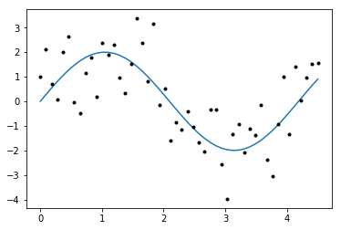
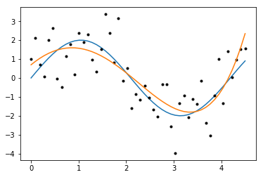
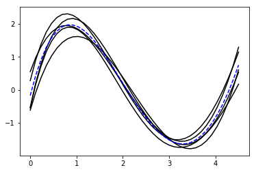
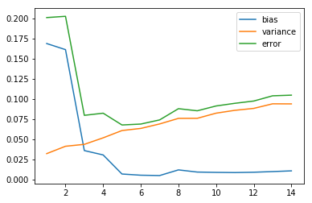
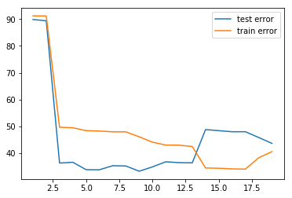

# Bias and Variance

이번 강의에서는 기계학습에서 자주 언급되는 bias and variance 에 대해서 공부한다. 또한 bias 와 variance의 tradeoff 와 관련된 현상을 관찰하고, 기계학습 모델의 overfitting 과 underfitting 에 대해서 공부한다.

## 인공 데이터 생성

먼저 다음과 같은 식을 이용하여 임의의 데이터를 생성한다고 하자.

$$r(x) = f(x) + \epsilon$$,

where $\epsilon \sim \mathcal{N}(0,1)$


```python
import numpy as np
for i in range(100):
    print(np.random.normal())
    
#100개 샘플링, 0근방이 많이 나오는 것을 확인할 수 있다, scale = 표준편차
```

    -1.196568942018636
    0.7386196564366041
    -0.566136754831954
    0.7070674982276528
    -0.21595555691277296
    -0.14064870455071418
    -0.4804941310144714
    0.276180539833946
    -0.0639739611235084
    -0.606230400423613
    -0.07116262130567177
    -0.8647810001720501
    -1.1346353243168452
    1.002359056447102
    -1.1784497579730127
    -0.7389636248381328
    0.2677213527568216
    0.9110838000679818
    0.9816725850816993
    -1.3552067846795264
    -1.024954267882937
    -0.0810817283663643
    -0.1434321334790178
    -1.0664711953727684
    0.7151115704821038
    0.8626526995932497
    -0.23098136750842707
    0.12617371332122543
    0.28724878354605954
    -0.464443880986379
    1.0983879287235763
    -0.018064178349429968
    -0.45048914090515607
    -0.7381439814955039
    0.8610025267283077
    -0.9406204770573744
    -0.48008839757006877
    0.2588226175904423
    -0.05036078953059039
    -1.2384485787139776
    -0.6403183612200288
    -0.2673574364117725
    -1.1279200033805565
    -0.9023192575313936
    -0.6431857184932087
    0.8165600785897285
    -1.6729878153856002
    0.4908602440243877
    -1.6310429204811683
    0.4656171686092783
    0.14153014588042964
    -0.06373063956533641
    1.5423415006821692
    1.2210454237818993
    -2.9318577758703688
    1.5126860800869357
    -0.06687233299768112
    1.645036441874168
    -1.7354991748774016
    -1.521350402081561
    -0.05303291072158525
    -0.6211295820751649
    -0.9365523357924668
    0.8106459511849855
    0.5205632421112905
    0.2573612642845941
    1.3564085165953366
    0.17853906094309993
    0.05363965193474323
    0.9569033772632216
    1.611172187441011
    -1.2645087576846041
    0.3454238342224725
    1.85477340398831
    0.3618425983224843
    -1.2108113237624911
    -0.20589488130146558
    -0.6800148512811877
    2.1502871878382344
    -0.9709636840094503
    0.24053917511806103
    1.257933181671301
    -0.7968747158768457
    -0.49183823096030177
    -0.8622382890312792
    -1.383728274852583
    -0.07256579085383524
    0.11086975026753507
    1.0874695729179147
    0.6625722504725261
    -0.8278398456596509
    -0.5540751855895976
    -1.7872081992429734
    0.05677496563003124
    0.6937012207135017
    -0.3782581369013455
    2.1042007706259267
    -0.9875715240613304
    -0.22350897655541954
    1.2935927301547012
    


```python
%matplotlib inline
import numpy as np
import pylab as pl

def f(size):
    '''
    Returns a sample with 'size' instances without noise.
    '''
    x = np.linspace(0, 4.5, size)
    y = 2 * np.sin(x * 1.5)
    return (x,y)

def sample(size):
    '''
    Returns a sample with 'size' instances.
    '''
    x = np.linspace(0, 4.5, size)
    y = 2 * np.sin(x * 1.5) + pl.randn(x.size) #random_normal (sampling), noise를 만들어 더한 것임
    return (x,y)
    
pl.clf()
f_x, f_y = f(50)
pl.plot(f_x, f_y)#sin함수 그림
x, y = sample(50)
pl.plot(x, y, 'k.')#노이즈 더한 것 그림
```


    [<matplotlib.lines.Line2D at 0x278afeb8550>]





위와 같은 인공데이터를 이제, 데이터를 생성한 모델 (위 식의 f함수)를 모른다고 가정하고, 최소자승법으로 학습한다고 해보자.

## Model Fitting

최소 자승법을 활용하여, 기존 모델을 학습할 때 먼저 x 값들을 이용하여 feature를 생성하는게 좋을 것이다.

각 샘플데이터 $x_{i}$를 이용하여 다음과 같은 벡터를 만들고  $(1 , x_{i} , x_{i}^{2} , \dots , x_{i}^{n})$ 최소자승법으로 모델을 최적화 하여 그 함수 $g:\mathbb{R}^{n+1}\rightarrow\mathbb{R}$가 training data에 가까워지도록 한다.

다음과 같은 예시를 활용해보자.


```python
x1 = np.array([1,2,3])
print (np.vander(x1, 4)) # 점들을 각각의 차원으로 채움
```

    [[ 1  1  1  1]
     [ 8  4  2  1]
     [27  9  3  1]]
    


```python
from sklearn.linear_model import LinearRegression

def fit_polynomial(x, y, degree):
    '''
    Fits a polynomial to the input sample.
    (x,y): input sample
    degree: polynomial degree
    '''
    model = LinearRegression()
    model.fit(np.vander(x, degree + 1), y)
    return model

def apply_polynomial(model, x):
    '''
    Evaluates a linear regression model in an input sample
    model: linear regression model
    x: input sample
    '''
    degree = model.coef_.size - 1
    y = model.predict(np.vander(x, degree + 1))
    return y

model = fit_polynomial(x, y, 4)                  ## degree를 바꾸어서 관찰해보세요! 
p_y = apply_polynomial(model, x)
pl.plot(f_x, f_y)
pl.plot(x, y, 'k.')
pl.plot(x, p_y)
```


    [<matplotlib.lines.Line2D at 0x278b35854a8>]





위 그래프에서 degree를 바꿔서 해보자.

bias 와 variance를 구하기 위하여는 모델을 학습하되 반복적으로 학습하여 통계적인 bias와 variance를 구한다. (bias는 우리가 전에 배운 weight and bias와 다른 개념이며, variance는 통계에서 분산과 같은 개념이다)

자 그렇다면, 위와 같이 모델을 반복적으로 학습하고 평균적인 모델의 퍼포먼스를 측정해보자.

## Model Averaging

아래 코드는 degree를 4로 하여 학습을 5번 반복하여, 평균적인 그래프를 점선으로 그리는 코드이다.


```python
degree = 4
n_samples = 40
n_models = 5
avg_y = np.zeros(n_samples)
for i in range(n_models):
    (x,y) = sample(n_samples)
    model = fit_polynomial(x, y, degree)
    p_y = apply_polynomial(model, x)
    avg_y = avg_y + p_y
    pl.plot(x, p_y, 'k-')
avg_y = avg_y / n_models
pl.plot(x, avg_y, 'b--')
#degree가 4일때로 학습 5번
```


    [<matplotlib.lines.Line2D at 0x278b35b17f0>]





## Bias 와 Variance 계산하기

위 코드를 활용하여, 각각의 degree에 따라 bias와 variance를 구해보자. 

아래의 코드를 활용하면, 각각의 degree에 따라 (복잡도가 다른 모델에 따라..) 모델을 반복적으로 학습하여 bias와 variance를 구해서 그래프로 그릴 수 있다.


```python
from numpy.linalg import norm
n_samples = 40
f_x, f_y = f(n_samples)
n_models = 100 #각 모델마다 100번 반복
max_degree = 15 #degree15까지 측정하겠다
var_vals =[]
bias_vals = []
error_vals = []
for degree in range(1, max_degree):
    avg_y = np.zeros(n_samples)
    models = []
    for i in range(n_models):
        (x,y) = sample(n_samples)
        model = fit_polynomial(x, y, degree)
        p_y = apply_polynomial(model, x)
        avg_y = avg_y + p_y
        models.append(p_y)
    avg_y = avg_y / n_models
    bias_2 = norm(avg_y - f_y)/f_y.size
    bias_vals.append(bias_2)
    variance = 0
    for p_y in models:
        variance += norm(avg_y - p_y)
    variance /= f_y.size * n_models
    var_vals.append(variance)
    error_vals.append(variance + bias_2)
pl.plot(range(1, max_degree), bias_vals, label='bias')
pl.plot(range(1, max_degree), var_vals, label='variance')
pl.plot(range(1, max_degree), error_vals, label='error')
pl.legend()
#degree 높을수록 bias가 커진다
```


    <matplotlib.legend.Legend at 0x278b46dc748>





bias가 적으면 적을 수록 좋은것인가?

variance 가 적으면 적을 수록 좋은 것인가?

물론 bias가 적으면 적을수록 좋다. 왜냐면 모델의 정확도가 그만큼 높아지기 때문이다.

우리가 위 그래프에서 관찰할 수 있는 것이 하나 더 있다. underfitting(low degree)일 경우 bias가 크고 variance가 작은반면, overfitting(high degree)일 경우 bias가 작고 variance 가 크다. 두가지를 동시에 만족하는것은 상당히 어렵고, 적정한 타협점을 찾아야 되므로 우리는 이것을 trade-off 라고 한다

눈으로 볼 때 적정점이 어디일까?

우리가 눈으로 확인한 적정점이 과연 잘 맞는지, cross-validation 을 통해 확인하자.


```python
n_samples = 40
# train sample
train_x, train_y = sample(n_samples)
# validation sample
test_x, test_y = sample(n_samples)
max_degree = 20
test_error_vals = []
train_error_vals = []
for degree in range(1, max_degree):
    model = fit_polynomial(train_x, train_y, degree)
    p_y = apply_polynomial(model, train_x)
    train_error_vals.append(pl.norm(train_y - p_y)**2)
    p_y = apply_polynomial(model, test_x)
    test_error_vals.append(pl.norm(test_y - p_y)**2)
pl.plot(range(1, max_degree), test_error_vals, label='test error')
pl.plot(range(1, max_degree), train_error_vals, label='train error')
pl.legend()
```


    <matplotlib.legend.Legend at 0x278b4758e80>





## 해결책? 


```python

```
