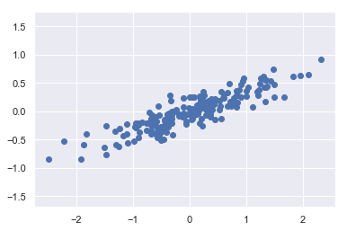

# Dimensional Reduction

차원 축소란 고려되는 랜덤변수의 숫자를 의미있는 랜덤변수로만 줄이는 과정으로 크게 feature selection 과 feature extraction 으로 나눌 수 있다. feature selection 이란 주어진 feature 들 중에 여러 시도를 통하여 성능이 제일 좋은 조합을 고르는 과정으로, 우리가 이전에 잠깐 봐 왔던 가장 간단한 방법이다. feature extraction 이란 고차원의 feature 를 변형하여 저차원으로 차원을 축소하는 알고리즘으로 대표적으로 Principal Component Analysis 가 있으며, 이번 장에서는 PCA에 대해 공부하도록 한다. 

## PCA

PCA 란 대표적인 비지도학습 알고리즘으로 통계학자, 기계학습의 컴퓨터 공학자 등으로부터 널리 사용되는 알고리즘이다. PCA는 기본적으로 차원 축소 알고리즘이기도 하며, 데이터 시각화를 위하여도 사용되기도 한다. 그 외에, 데이터의 노이즈를 줄이거나, feature extraction 또는 feature engineering 등 여러 분야에서 사용된다. 아래의 예를 통하여 설명을 이어가기로 한다. 


```python
%matplotlib inline
import numpy as np
import matplotlib.pyplot as plt
import seaborn as sns; sns.set()
```

아래와 같은 데이터가 있다고 가정하자. (우리는 전에 다변수 정규분포에 대하여 배웠으며, 복습은 생략하도록 한다)


```python
rng = np.random.RandomState(1)
X = np.dot(rng.rand(2, 2), rng.randn(2, 200)).T
plt.scatter(X[:, 0], X[:, 1])
plt.axis('equal');
# 인공 데이터로 크게 의미는 두지 말자. 
```





얼핏 그래프를 관찰하였을 때, y축 방향과 x 축 방향의 상관관계가 있음을 볼 수 있을 것이다. PCA에서는 이러한 관계가 수치화가 되어 주 축 (principa axes)를 데이터에서 찾고, 그 주 축을 중심으로 데이터를 설명하는 데 목적이 있다고 할 수 있다. Scikit-Learn 의 PCA estimator 를 통해 주 축 상에서의 값들을 찾아보도록 하자. 


```python
from sklearn.decomposition import PCA
pca = PCA(n_components=2)
pca.fit(X)
```


    PCA(copy=True, iterated_power='auto', n_components=2, random_state=None,
      svd_solver='auto', tol=0.0, whiten=False)


```python
print(pca.components_)
```

    [[-0.94446029 -0.32862557]
     [-0.32862557  0.94446029]]
    


```python
print(pca.explained_variance_) #각각의 축 방향으로 크기
```

    [0.7625315 0.0184779]
    

위에서 찾은 값들을 시각화 하여 위 값들이 의미하는 것을 설명하도록 하면 다음과 같다.


```python
def draw_vector(v0, v1, ax=None):
    ax = ax or plt.gca()
    arrowprops=dict(arrowstyle='->',
                    linewidth=2,
                    shrinkA=0, shrinkB=0)
    ax.annotate('', v1, v0, arrowprops=arrowprops)

# plot data
plt.scatter(X[:, 0], X[:, 1], alpha=0.2)
for length, vector in zip(pca.explained_variance_, pca.components_):
    v = vector * 3 * np.sqrt(length) # 짧아서 3곱해줌 (큰의미X)
    draw_vector(pca.mean_, pca.mean_ + v)
plt.axis('equal');
```


위 그림에서 두 벡터는 각각 데이터의 주 축 (principal axes)을 표현하고, 벡터의 길이는 축 값이 얼마나 "의미있는지"를 표현한다고 할 수 있다. (여기서는 데이터의 값들이 그 축에 투영될 때 분산값이라고 생각하면 된다). 각 principal axes 에 투영된 데이터의 값들이 "principal components"들이라고 한다.


여기까지는 우리가 앞에서 배운 다변수 정규분포의 내용가 유사하다. 이것이 Dimenasional Reduction 과 어떤 관계가 있는지 설명을 이어나가면 다음과 같다.

위 두 벡터를 볼 때, 하나의 벡터가 다른 하나보다 많이 크다는 것을 알 수 있다. 즉 이말은 두번 째 작은 벡터를 향한 값들을 무시해도, 데이터 측면에서 크게 손실이 없다는 것을 의미한다. 아래의 예를 통해 데이터의 분산을 95%만 유지한다고 할 때, 어떤 현상이 발생하는지 알아보도록 하자.


```python
clf = PCA(0.95) # keep 95% of variance
X_trans = clf.fit_transform(X)
print(X.shape)
print(X_trans.shape)
```

    (200, 2)
    (200, 1)
    

원 데이터는 2차원이였으나, 이제 변환된 데이터는 1차원의 값만 갖고 있는 것을 볼 수 있다.

이 그래프를 두 개의 벡터 중 긴 벡터에다 투영하면 다음과 같다.


```python
X_new = clf.inverse_transform(X_trans)
plt.plot(X[:, 0], X[:, 1], 'o', alpha=0.2)
plt.plot(X_new[:, 0], X_new[:, 1], 'ob', alpha=0.8)
plt.axis('equal');
```


이렇게 되 때, 우리는 큰 벡터 값에 의미있는 값들을 투영하고, 분산의 5% 의미 없는 값들은 버리게 된 것을 볼 수 있다. 이것이 데이터 차원 축소의 핵심이라고 할 수 있다. 5%의 노이즈를 줄이면서, 우리는 2차원의 데이터 값을 1차원으로 줄였음을 다시 한번 상기해보도록 하자.

PCA는 기계 학습 데이터 전처리에서도 많이 쓰이기도 하며, 고차원의 데이터를 시각화 할 때 (가장 의미있는 2개의 축 값을 이용하여), 또는 데이터를 압출할 때 많이 쓰이는 알고리즘이다.  

# IRIS data 

IRIS data (4차원 값을 2차원으로 줄여서 그래프로 그려보도록 하자)


```python
from sklearn import datasets
iris = datasets.load_iris()
```


```python
iris.data.shape #target, data값 따로있음
```


    (150, 4)


```python
X_original = iris.data
X = X_original[:, :2]
```


```python
from sklearn.decomposition import PCA
pca = PCA(n_components=2)
pca.fit(iris.data)
X_transformed = pca.transform(iris.data)

```


```python
plt.scatter(X_transformed[:, 0], X_transformed[:, 1], c=iris.target)
```


    <matplotlib.collections.PathCollection at 0x2a002245dd8>


```python
iris
```


    {'data': array([[5.1, 3.5, 1.4, 0.2],
            [4.9, 3. , 1.4, 0.2],
            [4.7, 3.2, 1.3, 0.2],
            [4.6, 3.1, 1.5, 0.2],
            [5. , 3.6, 1.4, 0.2],
            [5.4, 3.9, 1.7, 0.4],
            [4.6, 3.4, 1.4, 0.3],
            [5. , 3.4, 1.5, 0.2],
            [4.4, 2.9, 1.4, 0.2],
            [4.9, 3.1, 1.5, 0.1],
            [5.4, 3.7, 1.5, 0.2],
            [4.8, 3.4, 1.6, 0.2],
            [4.8, 3. , 1.4, 0.1],
            [4.3, 3. , 1.1, 0.1],
            [5.8, 4. , 1.2, 0.2],
            [5.7, 4.4, 1.5, 0.4],
            [5.4, 3.9, 1.3, 0.4],
            [5.1, 3.5, 1.4, 0.3],
            [5.7, 3.8, 1.7, 0.3],
            [5.1, 3.8, 1.5, 0.3],
            [5.4, 3.4, 1.7, 0.2],
            [5.1, 3.7, 1.5, 0.4],
            [4.6, 3.6, 1. , 0.2],
            [5.1, 3.3, 1.7, 0.5],
            [4.8, 3.4, 1.9, 0.2],
            [5. , 3. , 1.6, 0.2],
            [5. , 3.4, 1.6, 0.4],
            [5.2, 3.5, 1.5, 0.2],
            [5.2, 3.4, 1.4, 0.2],
            [4.7, 3.2, 1.6, 0.2],
            [4.8, 3.1, 1.6, 0.2],
            [5.4, 3.4, 1.5, 0.4],
            [5.2, 4.1, 1.5, 0.1],
            [5.5, 4.2, 1.4, 0.2],
            [4.9, 3.1, 1.5, 0.2],
            [5. , 3.2, 1.2, 0.2],
            [5.5, 3.5, 1.3, 0.2],
            [4.9, 3.6, 1.4, 0.1],
            [4.4, 3. , 1.3, 0.2],
            [5.1, 3.4, 1.5, 0.2],
            [5. , 3.5, 1.3, 0.3],
            [4.5, 2.3, 1.3, 0.3],
            [4.4, 3.2, 1.3, 0.2],
            [5. , 3.5, 1.6, 0.6],
            [5.1, 3.8, 1.9, 0.4],
            [4.8, 3. , 1.4, 0.3],
            [5.1, 3.8, 1.6, 0.2],
            [4.6, 3.2, 1.4, 0.2],
            [5.3, 3.7, 1.5, 0.2],
            [5. , 3.3, 1.4, 0.2],
            [7. , 3.2, 4.7, 1.4],
            [6.4, 3.2, 4.5, 1.5],
            [6.9, 3.1, 4.9, 1.5],
            [5.5, 2.3, 4. , 1.3],
            [6.5, 2.8, 4.6, 1.5],
            [5.7, 2.8, 4.5, 1.3],
            [6.3, 3.3, 4.7, 1.6],
            [4.9, 2.4, 3.3, 1. ],
            [6.6, 2.9, 4.6, 1.3],
            [5.2, 2.7, 3.9, 1.4],
            [5. , 2. , 3.5, 1. ],
            [5.9, 3. , 4.2, 1.5],
            [6. , 2.2, 4. , 1. ],
            [6.1, 2.9, 4.7, 1.4],
            [5.6, 2.9, 3.6, 1.3],
            [6.7, 3.1, 4.4, 1.4],
            [5.6, 3. , 4.5, 1.5],
            [5.8, 2.7, 4.1, 1. ],
            [6.2, 2.2, 4.5, 1.5],
            [5.6, 2.5, 3.9, 1.1],
            [5.9, 3.2, 4.8, 1.8],
            [6.1, 2.8, 4. , 1.3],
            [6.3, 2.5, 4.9, 1.5],
            [6.1, 2.8, 4.7, 1.2],
            [6.4, 2.9, 4.3, 1.3],
            [6.6, 3. , 4.4, 1.4],
            [6.8, 2.8, 4.8, 1.4],
            [6.7, 3. , 5. , 1.7],
            [6. , 2.9, 4.5, 1.5],
            [5.7, 2.6, 3.5, 1. ],
            [5.5, 2.4, 3.8, 1.1],
            [5.5, 2.4, 3.7, 1. ],
            [5.8, 2.7, 3.9, 1.2],
            [6. , 2.7, 5.1, 1.6],
            [5.4, 3. , 4.5, 1.5],
            [6. , 3.4, 4.5, 1.6],
            [6.7, 3.1, 4.7, 1.5],
            [6.3, 2.3, 4.4, 1.3],
            [5.6, 3. , 4.1, 1.3],
            [5.5, 2.5, 4. , 1.3],
            [5.5, 2.6, 4.4, 1.2],
            [6.1, 3. , 4.6, 1.4],
            [5.8, 2.6, 4. , 1.2],
            [5. , 2.3, 3.3, 1. ],
            [5.6, 2.7, 4.2, 1.3],
            [5.7, 3. , 4.2, 1.2],
            [5.7, 2.9, 4.2, 1.3],
            [6.2, 2.9, 4.3, 1.3],
            [5.1, 2.5, 3. , 1.1],
            [5.7, 2.8, 4.1, 1.3],
            [6.3, 3.3, 6. , 2.5],
            [5.8, 2.7, 5.1, 1.9],
            [7.1, 3. , 5.9, 2.1],
            [6.3, 2.9, 5.6, 1.8],
            [6.5, 3. , 5.8, 2.2],
            [7.6, 3. , 6.6, 2.1],
            [4.9, 2.5, 4.5, 1.7],
            [7.3, 2.9, 6.3, 1.8],
            [6.7, 2.5, 5.8, 1.8],
            [7.2, 3.6, 6.1, 2.5],
            [6.5, 3.2, 5.1, 2. ],
            [6.4, 2.7, 5.3, 1.9],
            [6.8, 3. , 5.5, 2.1],
            [5.7, 2.5, 5. , 2. ],
            [5.8, 2.8, 5.1, 2.4],
            [6.4, 3.2, 5.3, 2.3],
            [6.5, 3. , 5.5, 1.8],
            [7.7, 3.8, 6.7, 2.2],
            [7.7, 2.6, 6.9, 2.3],
            [6. , 2.2, 5. , 1.5],
            [6.9, 3.2, 5.7, 2.3],
            [5.6, 2.8, 4.9, 2. ],
            [7.7, 2.8, 6.7, 2. ],
            [6.3, 2.7, 4.9, 1.8],
            [6.7, 3.3, 5.7, 2.1],
            [7.2, 3.2, 6. , 1.8],
            [6.2, 2.8, 4.8, 1.8],
            [6.1, 3. , 4.9, 1.8],
            [6.4, 2.8, 5.6, 2.1],
            [7.2, 3. , 5.8, 1.6],
            [7.4, 2.8, 6.1, 1.9],
            [7.9, 3.8, 6.4, 2. ],
            [6.4, 2.8, 5.6, 2.2],
            [6.3, 2.8, 5.1, 1.5],
            [6.1, 2.6, 5.6, 1.4],
            [7.7, 3. , 6.1, 2.3],
            [6.3, 3.4, 5.6, 2.4],
            [6.4, 3.1, 5.5, 1.8],
            [6. , 3. , 4.8, 1.8],
            [6.9, 3.1, 5.4, 2.1],
            [6.7, 3.1, 5.6, 2.4],
            [6.9, 3.1, 5.1, 2.3],
            [5.8, 2.7, 5.1, 1.9],
            [6.8, 3.2, 5.9, 2.3],
            [6.7, 3.3, 5.7, 2.5],
            [6.7, 3. , 5.2, 2.3],
            [6.3, 2.5, 5. , 1.9],
            [6.5, 3. , 5.2, 2. ],
            [6.2, 3.4, 5.4, 2.3],
            [5.9, 3. , 5.1, 1.8]]),
     'target': array([0, 0, 0, 0, 0, 0, 0, 0, 0, 0, 0, 0, 0, 0, 0, 0, 0, 0, 0, 0, 0, 0,
            0, 0, 0, 0, 0, 0, 0, 0, 0, 0, 0, 0, 0, 0, 0, 0, 0, 0, 0, 0, 0, 0,
            0, 0, 0, 0, 0, 0, 1, 1, 1, 1, 1, 1, 1, 1, 1, 1, 1, 1, 1, 1, 1, 1,
            1, 1, 1, 1, 1, 1, 1, 1, 1, 1, 1, 1, 1, 1, 1, 1, 1, 1, 1, 1, 1, 1,
            1, 1, 1, 1, 1, 1, 1, 1, 1, 1, 1, 1, 2, 2, 2, 2, 2, 2, 2, 2, 2, 2,
            2, 2, 2, 2, 2, 2, 2, 2, 2, 2, 2, 2, 2, 2, 2, 2, 2, 2, 2, 2, 2, 2,
            2, 2, 2, 2, 2, 2, 2, 2, 2, 2, 2, 2, 2, 2, 2, 2, 2, 2]),
     'target_names': array(['setosa', 'versicolor', 'virginica'], dtype='<U10'),
     'DESCR': '.. _iris_dataset:\n\nIris plants dataset\n--------------------\n\n**Data Set Characteristics:**\n\n    :Number of Instances: 150 (50 in each of three classes)\n    :Number of Attributes: 4 numeric, predictive attributes and the class\n    :Attribute Information:\n        - sepal length in cm\n        - sepal width in cm\n        - petal length in cm\n        - petal width in cm\n        - class:\n                - Iris-Setosa\n                - Iris-Versicolour\n                - Iris-Virginica\n                \n    :Summary Statistics:\n\n    ============== ==== ==== ======= ===== ====================\n                    Min  Max   Mean    SD   Class Correlation\n    ============== ==== ==== ======= ===== ====================\n    sepal length:   4.3  7.9   5.84   0.83    0.7826\n    sepal width:    2.0  4.4   3.05   0.43   -0.4194\n    petal length:   1.0  6.9   3.76   1.76    0.9490  (high!)\n    petal width:    0.1  2.5   1.20   0.76    0.9565  (high!)\n    ============== ==== ==== ======= ===== ====================\n\n    :Missing Attribute Values: None\n    :Class Distribution: 33.3% for each of 3 classes.\n    :Creator: R.A. Fisher\n    :Donor: Michael Marshall (MARSHALL%PLU@io.arc.nasa.gov)\n    :Date: July, 1988\n\nThe famous Iris database, first used by Sir R.A. Fisher. The dataset is taken\nfrom Fisher\'s paper. Note that it\'s the same as in R, but not as in the UCI\nMachine Learning Repository, which has two wrong data points.\n\nThis is perhaps the best known database to be found in the\npattern recognition literature.  Fisher\'s paper is a classic in the field and\nis referenced frequently to this day.  (See Duda & Hart, for example.)  The\ndata set contains 3 classes of 50 instances each, where each class refers to a\ntype of iris plant.  One class is linearly separable from the other 2; the\nlatter are NOT linearly separable from each other.\n\n.. topic:: References\n\n   - Fisher, R.A. "The use of multiple measurements in taxonomic problems"\n     Annual Eugenics, 7, Part II, 179-188 (1936); also in "Contributions to\n     Mathematical Statistics" (John Wiley, NY, 1950).\n   - Duda, R.O., & Hart, P.E. (1973) Pattern Classification and Scene Analysis.\n     (Q327.D83) John Wiley & Sons.  ISBN 0-471-22361-1.  See page 218.\n   - Dasarathy, B.V. (1980) "Nosing Around the Neighborhood: A New System\n     Structure and Classification Rule for Recognition in Partially Exposed\n     Environments".  IEEE Transactions on Pattern Analysis and Machine\n     Intelligence, Vol. PAMI-2, No. 1, 67-71.\n   - Gates, G.W. (1972) "The Reduced Nearest Neighbor Rule".  IEEE Transactions\n     on Information Theory, May 1972, 431-433.\n   - See also: 1988 MLC Proceedings, 54-64.  Cheeseman et al"s AUTOCLASS II\n     conceptual clustering system finds 3 classes in the data.\n   - Many, many more ...',
     'feature_names': ['sepal length (cm)',
      'sepal width (cm)',
      'petal length (cm)',
      'petal width (cm)'],
     'filename': 'C:\\Users\\user\\Miniconda3\\lib\\site-packages\\sklearn\\datasets\\data\\iris.csv'}


