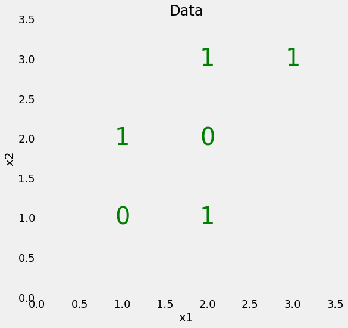

# Ensemble Learning

이번 강의에서는 기계학습에서 널리 이용되는 앙상블 알고리즘에 대해 공부하도록 한다. 
먼저 앙상블 알고리즘이 무엇인지 설명하면 다음과 같다. 

## Ensemble Learning 이란?

앙상블 알고리즘을 요약하면 다음과 같이 설명이 가능하다
- 복합적인 알고리즘을 합쳐 하나의 태스크를 수행 (일종의 협동)
- 일반적으로 단일 모델보다 예측능력이 뛰어남 (다양한 기계학습 알고리즘을 조합도 가능) 

다음과 같은 시나리오에서 앙상블 학습이 가능하다. 

(예), 분류기에서 Decision Tree, Support Vector Machine, Logistic Regression 의 예측값의 다수결로 예측

      

## 왜 Ensemble Learning 을 사용하는가?

다음과 같은 이유로 앙상블 러닝이 유용하게 사용되고 있다. 
- 정확도 높은 예측 (또는 적은 에러율)
- 과적화를 최소화함 (모델의 consistency 가 높음)
- Bias, Variance error 를 줄임

그렇다면, 어느 경우 앙상블 러닝을 사용하면 좋은지 알아보자.

## Ensemble Learning 은 언제 사용하는가? 

- 단일 모들이 과적화 될 때 
- 결과를 볼 때, 학습이 더 필요할 수 있다고 생각될 때 
- 앙상블 러닝은 분류기나 회귀 두 경우 다 사용가능하다

## Bagging 과 Boosting

Ensemble Learning 은 크게 Bagging 과 Boosting 으로 나뉘며, 개념도를 아래와 같이 참고하면 이해가 쉽다.

### Random Forest

Bagging 알고리즘 중 널리 사용되는 Random Forest 에 대해 이번강의를 통해 공부하도록 하자. Random Forest 를 공부하기 위해서 Decision Tree에 관해 간략하게 먼저 설명을 하면 다음과 같다.

### Decision Tree


```python
import numpy as np
import pandas as pd

RSEED = 50
```

다음과 같은 인공데이터를 기준으로 설명하겠다. X feature 값과 라벨값y 가 있다고 가정하자.


```python
X = np.array([[2, 2], 
              [2, 1],
              [2, 3], 
              [1, 2], 
              [1, 1],
              [3, 3]])

y = np.array([0, 1, 1, 1, 0, 1])
```

위 데이터를 그래프로 시각화 하면 다음과 같다.


```python
import matplotlib.pyplot as plt
%matplotlib inline
import seaborn as sns

# Plot formatting
plt.style.use('fivethirtyeight')
plt.rcParams['font.size'] = 18
plt.figure(figsize = (8, 8))

# Plot each point as the label
for x1, x2, label in zip(X[:, 0], X[:, 1], y):
    plt.text(x1, x2, str(label), fontsize = 40, color = 'g',
             ha='center', va='center')
    
# Plot formatting
plt.grid(None);
plt.xlim((0, 3.5));
plt.ylim((0, 3.5));
plt.xlabel('x1', size = 20); plt.ylabel('x2', size = 20); plt.title('Data', size = 24)
```


    Text(0.5, 1.0, 'Data')





위 그래프를 볼 때, 선형으로 잘 분류가 되지 않다는 것을 볼 수 있다. Decision Tree는 이런 경우 강력하게 두 클래스를 분류를 할 수 있다 (좋은 것일 수도... 나쁜 것일 수도...)


```python
from sklearn.tree import DecisionTreeClassifier

# Make a decision tree and train
tree = DecisionTreeClassifier(random_state=RSEED)
tree.fit(X, y)
```


    DecisionTreeClassifier(class_weight=None, criterion='gini', max_depth=None,
                max_features=None, max_leaf_nodes=None,
                min_impurity_decrease=0.0, min_impurity_split=None,
                min_samples_leaf=1, min_samples_split=2,
                min_weight_fraction_leaf=0.0, presort=False, random_state=50,
                splitter='best')


우리가 학습한 트리의 모델 정확도를 점검하면 다음과 같다.


```python
print(tree.score(X, y))
```

    1.0
    

완벽에 가까운 것을 볼 수 있다. 이 Decision Tree가 어떤 구조를 갖고 있는지 시각화해보도록 하자


```python
from sklearn.tree import export_graphviz

# Export as dot
export_graphviz(tree, 'tree.dot', rounded = True, 
                feature_names = ['x1', 'x2'], 
                class_names = ['0', '1'], filled = True)
```


```python
from subprocess import call
# Convert to png
#call(['dot', '-Tpng', 'tree.dot', '-o', 'tree.png', '-Gdpi=400']);
```


```python
from IPython.display import Image
Image('tree.png')
```


    ---------------------------------------------------------------------------

    TypeError                                 Traceback (most recent call last)

    ~\Miniconda3\lib\site-packages\IPython\core\formatters.py in __call__(self, obj, include, exclude)
        968 
        969             if method is not None:
    --> 970                 return method(include=include, exclude=exclude)
        971             return None
        972         else:
    

    ~\Miniconda3\lib\site-packages\IPython\core\display.py in _repr_mimebundle_(self, include, exclude)
       1242         if self.embed:
       1243             mimetype = self._mimetype
    -> 1244             data, metadata = self._data_and_metadata(always_both=True)
       1245             if metadata:
       1246                 metadata = {mimetype: metadata}
    

    ~\Miniconda3\lib\site-packages\IPython\core\display.py in _data_and_metadata(self, always_both)
       1251     def _data_and_metadata(self, always_both=False):
       1252         """shortcut for returning metadata with shape information, if defined"""
    -> 1253         b64_data = b2a_base64(self.data).decode('ascii')
       1254         md = {}
       1255         if self.metadata:
    

    TypeError: a bytes-like object is required, not 'str'


    ---------------------------------------------------------------------------

    TypeError                                 Traceback (most recent call last)

    ~\Miniconda3\lib\site-packages\IPython\core\formatters.py in __call__(self, obj)
        343             method = get_real_method(obj, self.print_method)
        344             if method is not None:
    --> 345                 return method()
        346             return None
        347         else:
    

    ~\Miniconda3\lib\site-packages\IPython\core\display.py in _repr_png_(self)
       1268     def _repr_png_(self):
       1269         if self.embed and self.format == self._FMT_PNG:
    -> 1270             return self._data_and_metadata()
       1271 
       1272     def _repr_jpeg_(self):
    

    ~\Miniconda3\lib\site-packages\IPython\core\display.py in _data_and_metadata(self, always_both)
       1251     def _data_and_metadata(self, always_both=False):
       1252         """shortcut for returning metadata with shape information, if defined"""
    -> 1253         b64_data = b2a_base64(self.data).decode('ascii')
       1254         md = {}
       1255         if self.metadata:
    

    TypeError: a bytes-like object is required, not 'str'


    <IPython.core.display.Image object>


이제 실제 데이터를 기반으로 Decision Tree를 테스트해보도록 하자.


```python
from sklearn.datasets import load_iris
from sklearn.tree import DecisionTreeClassifier, export_graphviz
```


```python
iris_data = load_iris()
model= DecisionTreeClassifier()
model.fit(iris_data.data, iris_data.target)
```


    DecisionTreeClassifier(class_weight=None, criterion='gini', max_depth=None,
                max_features=None, max_leaf_nodes=None,
                min_impurity_decrease=0.0, min_impurity_split=None,
                min_samples_leaf=1, min_samples_split=2,
                min_weight_fraction_leaf=0.0, presort=False, random_state=None,
                splitter='best')


```python
dot = export_graphviz(model,
                     out_file=None,
                     feature_names = iris_data.feature_names,
                     class_names = iris_data.target_names,
                     filled=True,
                     impurity=None,
                     )
graph=graphviz.Source(dot)
graph.render("iris_decision_Tree")
```


    ---------------------------------------------------------------------------

    NameError                                 Traceback (most recent call last)

    <ipython-input-11-dd9b639ba9b8> in <module>
          6                      impurity=None,
          7                      )
    ----> 8 graph=graphviz.Source(dot)
          9 graph.render("iris_decision_Tree")
    

    NameError: name 'graphviz' is not defined


## Random Forest 만들기

Random Forest 는 다음과 같은 과정으로 만든다


- 숲의 나무 갯수 정하기 (M)
- 나무마다 샘플 숫자 정하기 (n)
- 각 나무에서 사용될 feature 숫자 정하기 (f)

M개의 각 트리에서 다음과 같은 작업을 수행한다:
 - n개의 샘플을 추출 (중복 허용)
 - f 개의 feature 임의로 추출 
 - n개의 샘플과 f개의 feature로 decision tree training 
 - decision tree 결과 저장


아래는 Decision Tree 와 Random Forest의 비교


```python
from sklearn.tree     import DecisionTreeClassifier
from sklearn.ensemble import RandomForestClassifier
from sklearn.datasets import load_breast_cancer
from sklearn.model_selection import train_test_split
from sklearn.metrics import classification_report, confusion_matrix

bc = load_breast_cancer()
X = bc.data
y = bc.target

# Create our test/train split
X_train, X_test, y_train, y_test = train_test_split(X,y, random_state=42)

## build our models
decision_tree = DecisionTreeClassifier()
random_forest = RandomForestClassifier(n_estimators=100)

## Train the classifiers
decision_tree.fit(X_train, y_train)
random_forest.fit(X_train, y_train)

# Create Predictions
dt_pred = decision_tree.predict(X_test)
rf_pred = random_forest.predict(X_test)

# Check the performance of each model
print('Decision Tree Model')
print(classification_report(y_test, dt_pred, target_names=bc.target_names))

print('Random Forest Model')
print(classification_report(y_test, rf_pred, target_names=bc.target_names))

#Graph our confusion matrix
dt_cm = confusion_matrix(y_test, dt_pred)
rf_cm = confusion_matrix(y_test, rf_pred)
```

Random Forest 가 예측을 하는 과정은 다음과 같다

측정된 관측이 여러개 있다고 할 때 (o).
각각의 트리에 대해 (t) in the model:
  - o를 기반으로 예측값  (p) 생성 
  - p 를 P (리스트 형식)에 저장 

모델이 분류기라면:
 - 다수결로 count 가 가장 많은 p를 선택 
모델이 회귀모델이면, 
 - 평균값 p를 알려줌


```python
#Graph our confusion matrix
dt_cm = confusion_matrix(y_test, dt_pred)
rf_cm = confusion_matrix(y_test, rf_pred)
```


```python
import itertools
import matplotlib.pyplot as plt

def plot_confusion_matrix(cm, classes,
                          normalize=False,
                          title='Confusion matrix',
                          cmap=plt.cm.Blues):
    """
    Taken from http://scikit-learn.org/stable/auto_examples/model_selection/plot_confusion_matrix.html

    This function prints and plots the confusion matrix.
    Normalization can be applied by setting `normalize=True`.
    """
    if normalize:
        cm = cm.astype('float') / cm.sum(axis=1)[:, np.newaxis]
        print("Normalized confusion matrix")
    else:
        print('Confusion matrix, without normalization')

    print(cm)

    plt.imshow(cm, interpolation='nearest', cmap=cmap)
    plt.title(title)
    plt.colorbar()
    tick_marks = np.arange(len(classes))
    plt.xticks(tick_marks, classes, rotation=45)
    plt.yticks(tick_marks, classes)

    fmt = '.2f' if normalize else 'd'
    thresh = cm.max() / 2.
    for i, j in itertools.product(range(cm.shape[0]), range(cm.shape[1])):
        plt.text(j, i, format(cm[i, j], fmt),
                 horizontalalignment="center",
                 color="white" if cm[i, j] > thresh else "black")

    plt.tight_layout()
    plt.ylabel('True label')
    plt.xlabel('Predicted label')


np.set_printoptions(precision=2)

# Plot dt confusion matrix
plt.figure()
plot_confusion_matrix(dt_cm, classes=bc.target_names, normalize=True,
                      title='Decision Tree Confusion Matrix')
plt.show()

# Plot rf confusion matrix
plt.figure()
plot_confusion_matrix(rf_cm, classes=bc.target_names, normalize=True,
                      title='Random Forest confusion matrix')

plt.show()
```


```python

```
