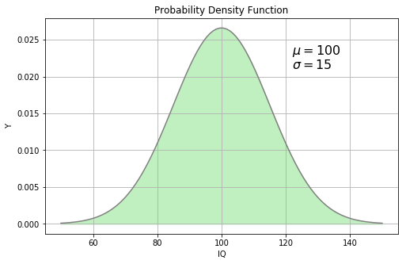
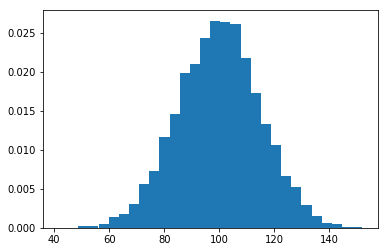
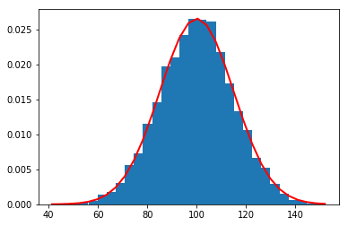
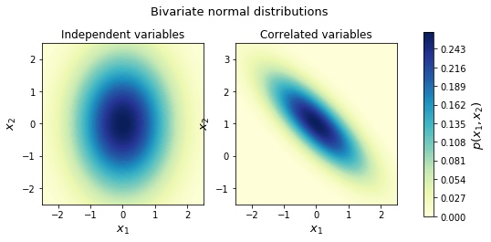

# Gaussian Mixture Model (GMM)

비지도 학습의 군집화에서 가장 대표적인 알고리즘은 K-means와 Gaussian Mixture Model (이하 GMM)이다. 지난 시간에 K-means 알고리즘과 그 구현에 관해 공부하였다. 이번 강의에서는 GMM에 대해 배경지식을 학습하는 시간을 갖도록 한다. GMM이란 한 문장으로 요약할 때, 복수의 Gaussian 모델이 혼합된 모델이다. 우리는 많은 자연 현상들이 LLN (Law of Large Numbers)에 의해 Gaussian Normal Distribution에 수렴하는 것을 알고 있다. GMM의 기본적인 가정은 각 군집이 고유의 Gaussian Distribution 을 갖고, 우리가 그 혼합된 Gaussian Model 들을 관측한다는 데 있다.

### Gaussian Normal Distribution

이번 강의에서는 먼저 간단한 (한개의) 1차원 Gaussian Model 의 성격과 (한개의) 다차원 Gaussian Model 에 관해 학습한다. 다차원의 경우, 편의상 2차원 Gaussian 에 대해 공부한다.

Gaussian PDF(확률분포함수)는 다음과 같다.
Probability Density Function

$$
pdf(x|\mu,\sigma)={1\over{σ\sqrt{2π}} }e({−(x-μ)^2 \over 2σ^2})
$$

그래프로 그리면, 하단과 같다.


```python
import numpy as np
from sympy import *
from IPython.display import *
init_printing(use_latex=True)
import matplotlib.pyplot as plt
%matplotlib inline
fig = plt.gcf()
fig.set_size_inches(8,5)
var('a b x sigma mu')
pdf = Lambda((x,mu,sigma),
  (1/(sigma * sqrt(2*pi)) * exp(-(mu-x)**2 / (2*sigma**2)))
)
ltx = '$ pdf(x,\\mu,\\sigma) = \\frac{1}{ \\sigma' + \
 '\\sqrt{2 \\pi}} e^{\\left(-\\frac{{\\left(\\mu - ' + \
 'x\\right)}^{2}}{2 \\, \\sigma^{2}}\\right)}$'
display(Latex(ltx))
x = np.linspace(50,150,100)
y = np.array([pdf(v,100,15) for v in x],dtype='float')
plt.grid(True)
plt.title('Probability Density Function')
plt.xlabel('IQ')
plt.ylabel('Y')
plt.text(122,0.023,'$\mu = 100$',fontsize=16)
plt.text(122,0.021,'$\sigma = 15$',fontsize=16)
plt.plot(x,y,color='gray')
plt.fill_between(x,y,0,color='#c0f0c0')
plt.show()
```


$ pdf(x,\mu,\sigma) = \frac{1}{ \sigma\sqrt{2 \pi}} e^{\left(-\frac{{\left(\mu - x\right)}^{2}}{2 \, \sigma^{2}}\right)}$





위 확률밀도함수를 통해 구간에서 사건이 발생할 확률을 설명해준다. (예를들면, 길거리에서 IQ가 80에서 120사이의 사람을 만날 확률은 80과 120 구간사이의 넓이가 된다: 그래서 우리는 이것을 확률밀도함수라고 한다)

### Sampling from (Univariate) Gaussian Distribution

자 그렇다면, 가우시간 분포를 따르는 모집단에서 추출(Sampling)을 하게 되면 어떻게 될까? -위 그래프를 볼 때, 길거리에서 사람을 만났을 때, IQ가 얼마인 사람을 만나기 쉬울까? 

numpy 라이브러리를 이용하여 직접 실험해보도록 하자. 


```python
mu, sigma = 100, 15 # mean and standard deviation
s = np.random.normal(mu, sigma, 1)   # 1 개의 샘플을 추출한다
s
```


    array([88.26171971])


```python
mu, sigma = 100, 15 # mean and standard deviation
s = np.random.normal(mu, sigma, 10000)   # 10000 개의 샘플을 추출한다
```


```python
import matplotlib.pyplot as plt
count, bins, ignored = plt.hist(s, 30, normed=True)
bins
#>>> plt.plot(bins
```

    C:\Users\user\Miniconda3\lib\site-packages\matplotlib\axes\_axes.py:6521: MatplotlibDeprecationWarning: 
    The 'normed' kwarg was deprecated in Matplotlib 2.1 and will be removed in 3.1. Use 'density' instead.
      alternative="'density'", removal="3.1")
    


    array([ 41.3248571 ,  45.01275547,  48.70065384,  52.38855221,
            56.07645058,  59.76434895,  63.45224733,  67.1401457 ,
            70.82804407,  74.51594244,  78.20384081,  81.89173918,
            85.57963755,  89.26753592,  92.95543429,  96.64333266,
           100.33123103, 104.0191294 , 107.70702778, 111.39492615,
           115.08282452, 118.77072289, 122.45862126, 126.14651963,
           129.834418  , 133.52231637, 137.21021474, 140.89811311,
           144.58601148, 148.27390986, 151.96180823])





```python
count, bins, ignored = plt.hist(s, 30, normed=True)
plt.plot(bins, 1/(sigma * np.sqrt(2 * np.pi)) *
                np.exp( - (bins - mu)**2 / (2 * sigma**2) ),
          linewidth=2, color='r')
plt.show()
```





## Sampling from (Multivariate) Gaussian Distribution

앞의 내용을 2차원으로 확장시켜보도록 하자. 

다원의 경우, 각 차원 마다 평균이 존재하고, covariance 행렬이 존재한다.

$$
p(\mathbf{x} \mid \mathbf{\mu}, \Sigma) = \frac{1}{\sqrt{(2\pi)^d \lvert\Sigma\rvert}} \exp{ \left( -\frac{1}{2}(\mathbf{x} - \mathbf{\mu})^T \Sigma^{-1} (\mathbf{x} - \mathbf{\mu}) \right)}
$$

위 식을 우리는 앞으로 아래와 같이 표기한다.

$$
\mathcal{N}(\mathbf{\mu}, \Sigma)
$$

확률 분포 함수를 코드로 작성하면 아래와 같다.


```python
def multivariate_normal(x, d, mean, covariance):
    """pdf of the multivariate normal distribution."""
    x_m = x - mean
    return (1. / (np.sqrt((2 * np.pi)**d * np.linalg.det(covariance))) * 
            np.exp(-(np.linalg.solve(covariance, x_m).T.dot(x_m)) / 2))
```

확률 분포 함수를 하단의 코드를 이용하여 우리는 그래프로 그릴 것이다 (아래의 코드는 참고만 바람)


```python
from matplotlib import cm # Colormaps
import matplotlib.gridspec as gridspec
from mpl_toolkits.axes_grid1 import make_axes_locatable
import seaborn as sns

# Plot bivariate distribution
def generate_surface(mean, covariance, d):
    """Helper function to generate density surface."""
    nb_of_x = 100 # grid size
    x1s = np.linspace(-5, 5, num=nb_of_x)
    x2s = np.linspace(-5, 5, num=nb_of_x)
    x1, x2 = np.meshgrid(x1s, x2s) # Generate grid
    pdf = np.zeros((nb_of_x, nb_of_x))
    # Fill the cost matrix for each combination of weights
    for i in range(nb_of_x):
        for j in range(nb_of_x):
            pdf[i,j] = multivariate_normal(
                np.matrix([[x1[i,j]], [x2[i,j]]]), 
                d, mean, covariance)
    return x1, x2, pdf  # x1, x2, pdf(x1,x2)

# subplot
fig, (ax1, ax2) = plt.subplots(nrows=1, ncols=2, figsize=(8,4))
d = 2  # number of dimensions

# Plot of independent Normals
bivariate_mean = np.matrix([[0.], [0.]])  # Mean
bivariate_covariance = np.matrix([
    [1., 0.], 
    [0., 2.]])  # Covariance
x1, x2, p = generate_surface(
    bivariate_mean, bivariate_covariance, d)
# Plot bivariate distribution
con = ax1.contourf(x1, x2, p, 100, cmap=cm.YlGnBu)
ax1.set_xlabel('$x_1$', fontsize=13)
ax1.set_ylabel('$x_2$', fontsize=13)
ax1.axis([-2.5, 2.5, -2.5, 2.5])
ax1.set_aspect('equal')
ax1.set_title('Independent variables', fontsize=12)

# Plot of correlated Normals
bivariate_mean = np.matrix([[0.], [1.]])  # Mean
bivariate_covariance = np.matrix([
    [1., -0.8], 
    [-0.8, 1.]])  # Covariance
x1, x2, p = generate_surface(
    bivariate_mean, bivariate_covariance, d)
# Plot bivariate distribution
con = ax2.contourf(x1, x2, p, 100, cmap=cm.YlGnBu)
ax2.set_xlabel('$x_1$', fontsize=13)
ax2.set_ylabel('$x_2$', fontsize=13)
ax2.axis([-2.5, 2.5, -1.5, 3.5])
ax2.set_aspect('equal')
ax2.set_title('Correlated variables', fontsize=12)

# Add colorbar and title
fig.subplots_adjust(right=0.8)
cbar_ax = fig.add_axes([0.85, 0.15, 0.02, 0.7])
cbar = fig.colorbar(con, cax=cbar_ax)
cbar.ax.set_ylabel('$p(x_1, x_2)$', fontsize=13)
plt.suptitle('Bivariate normal distributions', fontsize=13, y=0.95)
plt.show()
#왼쪽은 1, 1일떄
#오른쪽은 not independent
```





위 그래프에서 왼쪽과 오른쪽은 각각 
$$
\mathcal{N}\left(
\begin{bmatrix}
0 \\
0
\end{bmatrix}, 
\begin{bmatrix}
1 & 0 \\
0 & 1 
\end{bmatrix}\right)
$$

$$
\mathcal{N}\left(
\begin{bmatrix}
0 \\
1
\end{bmatrix}, 
\begin{bmatrix}
1 & 0.8 \\
0.8 & 1
\end{bmatrix}\right)
$$

이며, covariance matrix 에 따라 그 모양이 바뀌는 것을 확인 할 수 있다.


```python

```
