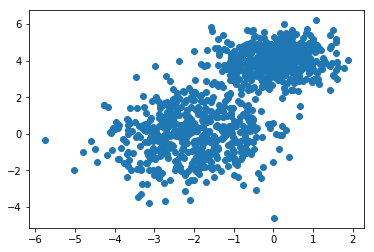

# GMM EM Algorithm

지난 시간 배운 내용과 같이, GMM을 학습하기 위하여는 Expectation Maximization (EM) 알고리즘을 활용한다. 

EM 알고리즘은 크게 E-step 과 M-step 으로 나눌 수 있으며, E-step 에서는 현재 parameter 기반으로 기대값을 계산하고, M-step에서는 그 기대값을 기반으로 목적함수를 최대화 할 수 있는 parameter 값들로 update 한다 (슬라이드를 참고하자) 

이번 시간에는 EM 알고리즘을 직접 구현해보도록 한다.


```python
from scipy.stats import multivariate_normal as mvn
```

위 함수를 통해 gaussian pdf 를 공식으로 직접 작성하는 것을 생략한다. 


```python
def em_gmm_orig(xs, pis, mus, sigmas, tol=0.01, max_iter=1000):

    n, p = xs.shape
    k = len(pis)

    ll_old = 0
    for i in range(max_iter):
        exp_A = []
        exp_B = []
        ll_new = 0

        # E-step
        ws = np.zeros((k, n))
        for j in range(len(mus)):
            for i in range(n):
                ws[j, i] = pis[j] * mvn(mus[j], sigmas[j]).pdf(xs[i])
        ws /= ws.sum(0)

        # M-step
        pis = np.zeros(k)
        for j in range(len(mus)):
            for i in range(n):
                pis[j] += ws[j, i]
        pis /= n

        mus = np.zeros((k, p))
        for j in range(k):
            for i in range(n):
                mus[j] += ws[j, i] * xs[i]
            mus[j] /= ws[j, :].sum()

        sigmas = np.zeros((k, p, p))
        for j in range(k):
            for i in range(n):
                ys = np.reshape(xs[i]- mus[j], (2,1))
                sigmas[j] += ws[j, i] * np.dot(ys, ys.T)
            sigmas[j] /= ws[j,:].sum()

        # update complete log likelihoood
        ll_new = 0.0
        for i in range(n):
            s = 0
            for j in range(k):
                s += pis[j] * mvn(mus[j], sigmas[j]).pdf(xs[i])
            ll_new += np.log(s)

        if np.abs(ll_new - ll_old) < tol:
            break
        ll_old = ll_new
        print(ll_new)

    return ll_new, pis, mus, sigmas
```

그렇다면, GMM의 인공데이터를 만들어보고, 위 EM algorithm 을 이용하여 학습해보도록 하자.

np.random.multivariate_normla 함수를 사용해보자.


```python
import numpy as np
#np.random.seed(123)


# create data set
n = 1000  # number of dataset 
_mus = np.array([[0,4], [-2,0]])
_sigmas = np.array([[[0.5, 0], [0, 0.5]], [[1,0],[0,2]]])
#mu는 평균, sigma는 분산

ci = np.random.binomial(1, 0.5, n)    # 0.6의 확률로 1, 0.4의 확률로 0   1000 개를 샘플링 

ci.sum()
```


    513


```python
ci.shape
```


    (1000,)


```python
xs = []
for i in range(n):
    cluster_index = ci[i]
    mu = _mus[cluster_index]
    sigma = _sigmas[cluster_index] #covarience matrix라서 무늬를 결정함
    xs.append( np.random.multivariate_normal(mu, sigma ))
    
xs = np.array(xs)
```


```python
xs
```


    array([[-0.49846714,  4.82468537],
           [-3.43662031, -1.90045042],
           [ 1.42951213,  5.41508361],
           ...,
           [ 0.77693093,  3.86733232],
           [-2.26359823,  1.72882051],
           [-2.41318279,  1.87801327]])


그래프로 먼저 확인해보자.


```python
%matplotlib inline
import matplotlib.pyplot as plt
plt.scatter(xs[:,0],xs[:,1])

#GMM이 생성한 데이터
```


    <matplotlib.collections.PathCollection at 0x2d35479e588>





이제 모든 파라미터 값들을 모른다고 가정하고 위 데이터만을 이용하여 시스템을 학습해보도록 하자.

초기 guessing


```python
# initial guesses for parameters
pis = np.random.random(2)
pis /= pis.sum()
mus = np.random.random((2,2))
sigmas = np.array([np.eye(2)] * 2)
```


```python
pis
```


    array([0.42357726, 0.57642274])


```python
ll2, pis2, mus2, sigmas2 = em_gmm_orig(xs, pis, mus, sigmas)
```

    -3627.4206499411757
    -3593.0970022575452
    -3536.6193723038427
    -3456.932531271725
    -3402.2642674193885
    -3383.578326893476
    -3375.5539678613145
    -3371.467619091778
    -3369.580682545484
    -3368.8126401598347
    -3368.526644653806
    -3368.425595749165
    -3368.3909252267877
    -3368.3792224818426
    

우리가 학습한 값과 실제 시스템의 파라미터값을 비교해보자.


```python
sigmas
```


    array([[[1., 0.],
            [0., 1.]],
    
           [[1., 0.],
            [0., 1.]]])


```python
sigmas2
```


    array([[[0.51931652, 0.02190415],
            [0.02190415, 0.55075455]],
    
           [[1.05833182, 0.15861284],
            [0.15861284, 1.97632674]]])


```python

```
