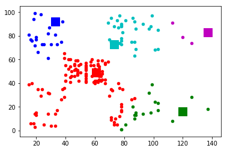

# K-means

1. 임의의 centroid 값을 기준으로 알고리즘을 실행(시작)
2. 각 데이터 포인트와 centroid 와의 거리를 비교하여 가장 가까운 centroid 찾음
3. centroid 를 업데이트 (주어진 군집에 속한 점들의 평균값을 이용하여 centroid 값 바꿈) 

data 가져오기


```python
import pandas as pd
import numpy as np
import matplotlib.pyplot as plt
from sklearn.cluster import KMeans
%matplotlib inline
```

STEP 1


```python
import random as rd

dataset = pd.read_csv('Mall_Customers.csv') #data 가져오기
X = dataset.iloc[:, [3, 4]].values # 3, 4를 씀

m = X.shape[0]
n = X.shape[1]
n_iter = 200

K = 5
Centroids = np.zeros((K, n))

sampled_index = rd.sample(range(m), K)

for i in range(K):
    rand = sampled_index[i]
    Centroids[i] = X[rand]
```

STEP 2


```python
# a
for i in range(n_iter):
    EuclidianDistance = np.zeros((m, K))
    for j in range(m):
        EuclidianDistance[j] = np.sum((X[j] - Centroids[:])**2, axis=1)
        C = np.argmin(EuclidianDistance, axis=1)+1
# b
    Y = {}
    for k in range(K):
        Y[k+1] = []
    for i in range(m):
        Y[C[i]].append(X[i])

colors = ['r', 'g', 'b', 'c', 'm']
for i in range(m):
    plt.scatter(X[i][0], X[i][1], s=20, c=colors[C[i]-1])
for k in range(K):
    plt.scatter(Centroids[k][0], Centroids[k][1], s=200, c=colors[k], marker='s')
plt.show()
```




