# SVM

## 1.import할 모듈들 넣기


```python
import numpy as np
import matplotlib.pyplot as plt
from scipy import stats
import seaborn as sns; sns.set()

%matplotlib inline
```

## 2. 랜덤 data 생성


```python
from sklearn.datasets.samples_generator import make_blobs

X, y = make_blobs(n_samples=50, centers=2, random_state=0, cluster_std=0.60)
plt.scatter(X[:, 0], X[:, 1], c=y, s=50, cmap='autumn')
```


    <matplotlib.collections.PathCollection at 0x1ad7abe6780>


## decision boundary 그리기 - 중간에 있는 선이 가장 좋음


```python
xfit = np.linspace(-1, 3.5)
plt.scatter(X[:, 0], X[:, 1], c=y, s=50, cmap='autumn')

for m, b in [(1, 0.65), (0.5, 1.6), (-0.2, 2.9)]: #기울기와 y절편
    plt.plot(xfit, m * xfit + b, '-k')

plt.xlim(-1, 3.5);
```


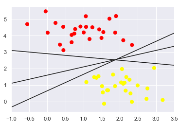


마진 높이기가 중요 (margin : 점들과의 거리 중 최단)
## SVM


```python
from sklearn.svm import SVC
model = SVC(kernel='linear', C=1E10) #c가 작을수록 마진 soft
model.fit(X, y)
```


    SVC(C=10000000000.0, cache_size=200, class_weight=None, coef0=0.0,
      decision_function_shape='ovr', degree=3, gamma='auto_deprecated',
      kernel='linear', max_iter=-1, probability=False, random_state=None,
      shrinking=True, tol=0.001, verbose=False)


그림 그려주는 함수


```python
def plot_svc_decision_function(model, ax=None, plot_support=True):
    if ax is None:
        ax = plt.gca() #matplotlib의 기본 축들을 그냥 씀
    xlim = ax.get_xlim() # 0~1
    ylim = ax.get_ylim() # 0~1
    
    x = np.linspace(xlim[0], xlim[1], 30) # 0~1 사이의 값 30개
    y = np.linspace(ylim[0], ylim[1], 30)
    
    Y, X = np.meshgrid(y, x)
    xy = np.vstack([X.ravel(), Y.ravel()]).T #ravel - 1차원으로, vstack - 합치기
    P = model.decision_function(xy).reshape(X.shape) 
    
    ax.contour(X, Y, P, colors='k', levels=[-1, 0, 1], alpha=0.5, linestyles=['--', '-', '--'])
    
    if plot_support:
        ax.scatter(model.support_vectors_[:, 0],
                   model.support_vectors_[:, 1],
                   s=300, linewidth=1, facecolors='none')
    ax.set_xlim(xlim)
    ax.set_ylim(ylim)
```


```python
plt.scatter(X[:, 0], X[:, 1], c=y, s=50, cmap='autumn')
plot_svc_decision_function(model,plot_support=False);
```


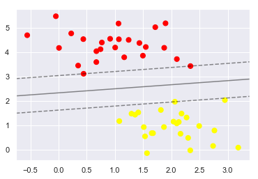


## non-linear deecision boundary


```python
from sklearn.datasets.samples_generator import make_circles
X, y = make_circles(100, factor=.1, noise=.1)

clf = SVC(kernel='linear').fit(X, y)

plt.scatter(X[:, 0], X[:, 1], c=y, s=50, cmap='autumn')
plot_svc_decision_function(clf, plot_support=False);
```


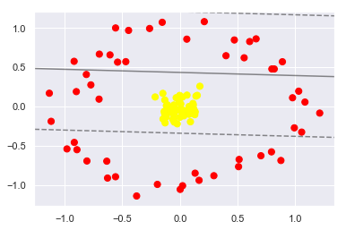


```python
clf = SVC(kernel='rbf', C=1E6)
clf.fit(X, y)
```

    C:\Users\user\Miniconda3\lib\site-packages\sklearn\svm\base.py:196: FutureWarning: The default value of gamma will change from 'auto' to 'scale' in version 0.22 to account better for unscaled features. Set gamma explicitly to 'auto' or 'scale' to avoid this warning.
      "avoid this warning.", FutureWarning)
    


    SVC(C=1000000.0, cache_size=200, class_weight=None, coef0=0.0,
      decision_function_shape='ovr', degree=3, gamma='auto_deprecated',
      kernel='rbf', max_iter=-1, probability=False, random_state=None,
      shrinking=True, tol=0.001, verbose=False)


```python
plt.scatter(X[:, 0], X[:, 1], c=y, s=50, cmap='autumn')
plot_svc_decision_function(clf)
plt.scatter(clf.support_vectors_[:, 0], clf.support_vectors_[:, 1],s=300, lw=1, facecolors='none');
```


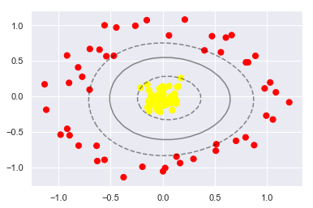


```python
X, y = make_blobs(n_samples=100, centers=2,
                  random_state=0, cluster_std=1.2)
plt.scatter(X[:, 0], X[:, 1], c=y, s=50, cmap='autumn');
```


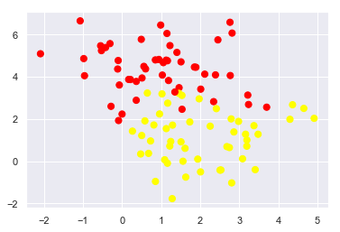


# Bias and Variance

## 인공 데이터 생성

$r(x) = f(x) + \epsilon$,

where $\epsilon \sim \mathcal{N}(0,1)$


```python
%matplotlib inline
import numpy as np

def f(size): # 0~4.5사이의 sin값 만들기
    x = np.linspace(0, 4.5, size)
    y = 2 * np.sin(x * 1.5)
    return (x, y)

def sample(size):
    x = np.linspace(0, 4.5, size)
    y = 2 * np.sin(x * 1.5) + np.random.randn(x.size)
    return (x, y)

f_x, f_y = f(50)
plt.plot(f_x, f_y)
x, y = sample(50)
plt.plot(x, y, 'k.')
```


    [<matplotlib.lines.Line2D at 0x1ad7c0502e8>]


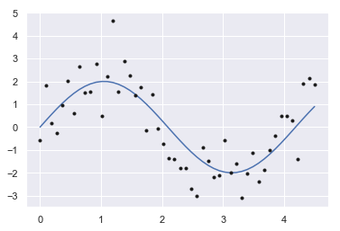


## model 만들기

최소자승법 : (Y - pred_Y)^2를 최소로 만들기 (즉 cost를 최소로)


```python
x1 = np.array([1, 2, 3])
print(np.vander(x1, 4))
```

    [[ 1  1  1  1]
     [ 8  4  2  1]
     [27  9  3  1]]
    


```python
from sklearn.linear_model import LinearRegression

def fit_polynomial(x, y, degree):
    model = LinearRegression()
    model.fit(np.vander(x, degree + 1), y)
    return model

def apply_polynomial(model, x):
    degree = model.coef_.size - 1 #계수의 사이즈
    y = model.predict(np.vander(x, degree + 1))
    return y
```


```python
model = fit_polynomial(x, y, 4)
p_y = apply_polynomial(model, x)
plt.plot(f_x, f_y)
plt.plot(x, y, 'k.')
plt.plot(x, p_y)
```


    [<matplotlib.lines.Line2D at 0x1ad7c08b048>]


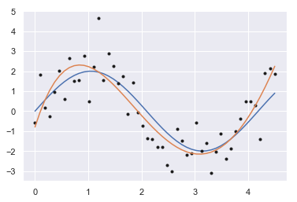


## model 학습시키기


```python
degree = 4
n_samples = 40
iteration = 5
avg_y = np.zeros(n_samples)
```


```python
for i in range(iteration):
    (x, y) = sample(n_samples)
    model = fit_polynomial(x, y, degree)
    p_y = apply_polynomial(model, x)
    avg_y = avg_y + p_y
    plt.plot(x, p_y, 'b--')
avg_y = avg_y / iteration
plt.plot(x, avg_y, 'k-')
```


    [<matplotlib.lines.Line2D at 0x1ad7c1012e8>]


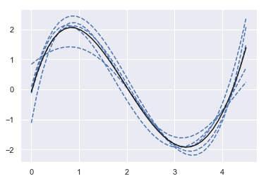


## bias & variance 계산


```python
from numpy.linalg import norm

n_samples = 40
f_x, f_y = f(n_samples)
iteration = 100
degree = 5

avg_y = np.zeros(n_samples)
for i in range(iteration):
    (x, y) = sample(n_samples)
    model = fit_polynomial(x, y, degree)
    p_y = apply_polynomial(model, x)
    avg_y = avg_y + p_y
avg_y = avg_y / iteration
bias = norm(avg_y - f_y)/f_y.size
print(bias)
#variance ??
```

    0.007261257350832428
    

# K-means

1. 임의의 centroid 값을 기준으로 알고리즘을 실행(시작)
2. 각 데이터 포인트와 centroid 와의 거리를 비교하여 가장 가까운 centroid 찾음
3. centroid 를 업데이트 (주어진 군집에 속한 점들의 평균값을 이용하여 centroid 값 바꿈) 

data 가져오기


```python
import pandas as pd
import numpy as np
import matplotlib.pyplot as plt
from sklearn.cluster import KMeans
%matplotlib inline
```

STEP 1


```python
import random as rd

dataset = pd.read_csv('Mall_Customers.csv') #data 가져오기
X = dataset.iloc[:, [3, 4]].values # 3, 4를 씀

m = X.shape[0]
n = X.shape[1]
n_iter = 300

K = 5
Centroids = np.zeros((K, n))

sampled_index = rd.sample(range(m), K)

for i in range(K):
    rand = sampled_index[i]
    Centroids[i] = X[rand]
```

STEP 2


```python
# a
for i in range(n_iter):
    EuclidianDistance = np.zeros((m, K))
    for j in range(m):
        EuclidianDistance[j] = np.sum((X[j] - Centroids[:])**2, axis=1)
        C = np.argmin(EuclidianDistance, axis=1)+1
# b
    Y = {}
    for k in range(K):
        Y[k+1] = []
    for i in range(m):
        Y[C[i]].append(X[i])
```


```python
colors = ['r', 'g', 'b', 'c', 'm']
for i in range(m):
    plt.scatter(X[i][0], X[i][1], s=20, c=colors[C[i]-1])
for k in range(K):
    plt.scatter(Centroids[k][0], Centroids[k][1], s=200, c=colors[k], marker='s')
plt.show()
```


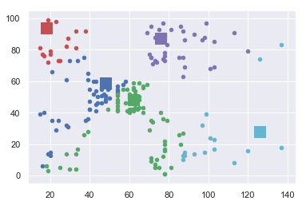


# GMM EM


```python
dataset = pd.read_csv('Mall_Customers.csv') #data 가져오기
X = dataset.iloc[:, [3, 4]].values # 3, 4를 씀
```


```python
from scipy.stats import multivariate_normal as mvn

row, col = X.shape
tol = 0.01
max_iter=100
```


```python
k = 5
pis = np.random.random(k)
pis /= pis.sum()
mus = np.random.random((k, col))
sigmas = np.array([np.eye(col)] * k)

print(pis)
print(mus)
print(sigmas)
```

    [0.16372775 0.27185428 0.23136406 0.2564953  0.07655861]
    [[0.45400862 0.76282637]
     [0.2902203  0.84908507]
     [0.62239071 0.22238998]
     [0.53314866 0.93871943]
     [0.84628178 0.96408514]]
    [[[1. 0.]
      [0. 1.]]
    
     [[1. 0.]
      [0. 1.]]
    
     [[1. 0.]
      [0. 1.]]
    
     [[1. 0.]
      [0. 1.]]
    
     [[1. 0.]
      [0. 1.]]]
    


```python
ll_old = 0

for iter in range(max_iter):
    ll_new = 0
    
    # E STEP
    ws = np.ones((row, k))
    for i in range(row):
         for j in range(k):
                if pis[j] * mvn(mus[j], sigmas[j]).pdf(X[i]) != 0.0:
                    print(i, j)
                ws[i, j] = pis[j] * mvn(mus[j], sigmas[j]).pdf(X[i])
    ws /= ws.sum(0)
    
    for i in range(row):
        if ws[i].sum() != 0.0 :
            print(i)
    
    
    # M STEP
    pis = np.zeros(k)
    for i in range(k):
        for j in range(row):
            pis[i] += ws[j, i]
    pis /= row
    
    mus = np.zeros((k, col))
    for i in range(k):
        for j in range(row):
            mus[i] += ws[j, i] * X[j]
        #print("2 :", ws[:, i].sum())
        mus[i] /= ws[:, i].sum()
    
    sigmas = np.zeros((k, col, col))
    for i in range(k):
        for j in range(row):
            ys = np.reshape(X[j] - mus[i], (2,1))
            sigmas[i] += ws[j, i] * np.dot(ys, ys.T)
        #print("3 :", ws[:, i].sum())
        sigmas[i] /= ws[:, i].sum()
        
    ll_new = 0.0
    
    for i in range(row):
        s = 0
        for j in range(k):
            s += pis[j] * mvn(mus[j], sigmas[j]).pdf(X[i]) #얘가 0이라 문제
        #print(s)
        ll_new += np.log(s)
        
    if np.abs(ll_new - ll_old) < tol:
        break
    ll_old = ll_new
    print(ll_new)

```

    2 0
    2 1
    2 2
    2 3
    2 4
    6 0
    6 1
    6 2
    6 3
    6 4
    8 0
    8 1
    8 2
    8 3
    8 4
    10 0
    10 1
    10 2
    10 3
    10 4
    12 0
    12 1
    12 2
    12 3
    12 4
    14 0
    14 1
    14 2
    14 3
    14 4
    18 0
    18 1
    18 2
    18 3
    18 4
    22 0
    22 1
    22 2
    22 3
    22 4
    24 0
    24 1
    24 2
    24 3
    24 4
    30 0
    30 1
    30 2
    30 3
    30 4
    32 0
    32 1
    32 2
    32 3
    32 4
    34 0
    34 1
    34 2
    34 3
    34 4
    36 0
    36 1
    36 2
    36 3
    36 4
    2
    6
    8
    10
    12
    14
    18
    22
    24
    30
    32
    34
    36
    

    C:\Users\user\Miniconda3\lib\site-packages\ipykernel_launcher.py:49: RuntimeWarning: divide by zero encountered in log
    

    -inf
    2 0
    2 1
    2 2
    2 3
    2 4
    2
    


    ---------------------------------------------------------------------------

    LinAlgError                               Traceback (most recent call last)

    <ipython-input-25-02e7179a77e4> in <module>
         45         s = 0
         46         for j in range(k):
    ---> 47             s += pis[j] * mvn(mus[j], sigmas[j]).pdf(X[i]) #얘가 0이라 문제
         48         #print(s)
         49         ll_new += np.log(s)
    

    ~\Miniconda3\lib\site-packages\scipy\stats\_multivariate.py in __call__(self, mean, cov, allow_singular, seed)
        361         return multivariate_normal_frozen(mean, cov,
        362                                           allow_singular=allow_singular,
    --> 363                                           seed=seed)
        364 
        365     def _process_parameters(self, dim, mean, cov):
    

    ~\Miniconda3\lib\site-packages\scipy\stats\_multivariate.py in __init__(self, mean, cov, allow_singular, seed, maxpts, abseps, releps)
        734         self.dim, self.mean, self.cov = self._dist._process_parameters(
        735                                                             None, mean, cov)
    --> 736         self.cov_info = _PSD(self.cov, allow_singular=allow_singular)
        737         if not maxpts:
        738             maxpts = 1000000 * self.dim
    

    ~\Miniconda3\lib\site-packages\scipy\stats\_multivariate.py in __init__(self, M, cond, rcond, lower, check_finite, allow_singular)
        161         d = s[s > eps]
        162         if len(d) < len(s) and not allow_singular:
    --> 163             raise np.linalg.LinAlgError('singular matrix')
        164         s_pinv = _pinv_1d(s, eps)
        165         U = np.multiply(u, np.sqrt(s_pinv))
    

    LinAlgError: singular matrix


```python
print(pis.shape)
print(mus.shape)
print(sigmas.shape)
```


```python

```

# Dimensional Reduction

## PCA : 차원 축소 알고리즘

1. 2차원에서의 PCA


```python
%matplotlib inline
import numpy as np
import matplotlib.pyplot as plt
import seaborn as sns; sns.set()
```


```python
rng = np.random.RandomState(1)
X = np.dot(rng.rand(2, 2), rng.randn(2, 200)).T
plt.scatter(X[:, 0], X[:, 1])
plt.axis('equal')
```


    (-2.7391278364515688,
     2.5801310701596343,
     -0.9477947579593762,
     1.019590430670684)


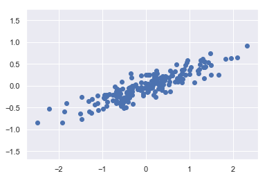


```python
from sklearn.decomposition import PCA
pca = PCA(n_components=2)
pca.fit(X)
```


    PCA(copy=True, iterated_power='auto', n_components=2, random_state=None,
      svd_solver='auto', tol=0.0, whiten=False)


```python
print(pca.components_)
```

    [[-0.94446029 -0.32862557]
     [-0.32862557  0.94446029]]
    


```python
print(pca.explained_variance_)
```

    [0.7625315 0.0184779]
    


```python
def draw_vector(v0, v1, ax=None):
    ax = ax or plt.gca()
    arrowprops = dict(arrowstyle='->', linewidth=2, shrinkA=0, shrinkB=0)
    ax.annotate('', v1, v0, arrowprops=arrowprops)
    
plt.scatter(X[:, 0], X[:, 1], alpha=0.2)
for length, vector in zip(pca.explained_variance_, pca.components_):
    v = vector * 3 * np.sqrt(length)
    draw_vector(pca.mean_, pca.mean_ + v)
plt.axis('equal');
```


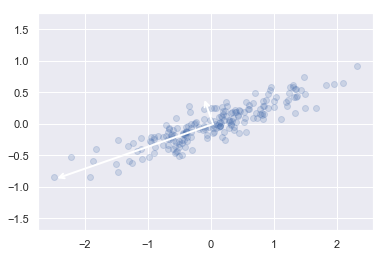


```python
clf = PCA(0.95)
X_trans = clf.fit_transform(X)
print(X.shape)
print(X_trans.shape)
```

    (200, 2)
    (200, 1)
    


```python
X_new = clf.inverse_transform(X_trans)
plt.plot(X[:, 0], X[:, 1], 'o', alpha=0.2)
plt.plot(X_new[:, 0], X_new[:, 1], 'ob', alpha=0.8)
plt.axis('equal')
```


    (-2.731158226766438, 2.609901883259332, -0.9672765706389316, 1.006064230853995)


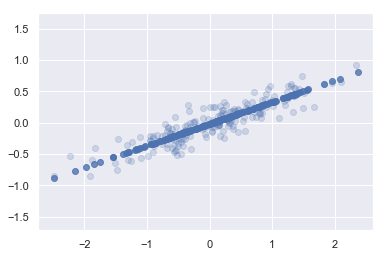


iris data에 적용


```python
from sklearn import datasets
iris = datasets.load_iris()
```


```python
iris.data.shape
```


    (150, 4)


```python
X_original = iris.data
X = X_original[:, :2]
```


```python
from sklearn.decomposition import PCA

pca = PCA(n_components=2)
pca.fit(iris.data)
X_transformed = pca.transform(iris.data)
```


```python
plt.scatter(X_transformed[:, 0], X_transformed[:, 1], c=iris.target)
```


    <matplotlib.collections.PathCollection at 0x1ad7c5c2cf8>


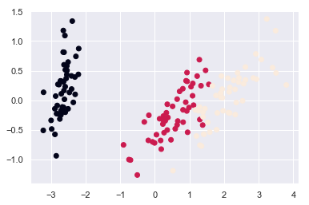


# Ensemble Learning

1. Decision Tree


```python
import numpy as np
import pandas as pd

RSEED = 50
```


```python
X = np.array([[2, 2], 
              [2, 1],
              [2, 3], 
              [1, 2], 
              [1, 1],
              [3, 3]])

y = np.array([0, 1, 1, 1, 0, 1])
```


```python
import matplotlib.pyplot as plt
%matplotlib inline
import seaborn as sns

# Plot formatting
plt.style.use('fivethirtyeight')
plt.rcParams['font.size'] = 18
plt.figure(figsize = (8, 8))

# Plot each point as the label
for x1, x2, label in zip(X[:, 0], X[:, 1], y):
    plt.text(x1, x2, str(label), fontsize = 30, color = 'g',
             ha='center', va='center')
    
# Plot formatting
plt.grid(None);
plt.xlim((0, 3.5));
plt.ylim((0, 3.5));
plt.xlabel('x1', size = 20); plt.ylabel('x2', size = 20); plt.title('Data', size = 24)
```


    Text(0.5, 1.0, 'Data')


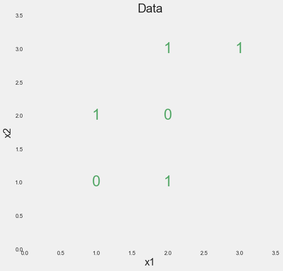


```python
from sklearn.tree import DecisionTreeClassifier

tree = DecisionTreeClassifier(random_state=RSEED)
tree.fit(X, y)
```


    DecisionTreeClassifier(class_weight=None, criterion='gini', max_depth=None,
                max_features=None, max_leaf_nodes=None,
                min_impurity_decrease=0.0, min_impurity_split=None,
                min_samples_leaf=1, min_samples_split=2,
                min_weight_fraction_leaf=0.0, presort=False, random_state=50,
                splitter='best')


```python
print(tree.score(X, y))
```

    1.0
    

iris data로 테스트


```python
from sklearn.datasets import load_iris
from sklearn.tree import DecisionTreeClassifier
```


```python
iris_data = load_iris()
model = DecisionTreeClassifier()
model.fit(iris_data.data, iris_data.target)
```


    DecisionTreeClassifier(class_weight=None, criterion='gini', max_depth=None,
                max_features=None, max_leaf_nodes=None,
                min_impurity_decrease=0.0, min_impurity_split=None,
                min_samples_leaf=1, min_samples_split=2,
                min_weight_fraction_leaf=0.0, presort=False, random_state=None,
                splitter='best')


random Forest


```python
from sklearn.tree import DecisionTreeClassifier
from sklearn.ensemble import RandomForestClassifier
from sklearn.datasets import load_breast_cancer
from sklearn.model_selection import train_test_split
from sklearn.metrics import classification_report, confusion_matrix

bc = load_breast_cancer()
X = bc.data
y = bc.target

X_train, X_test, y_train, y_test = train_test_split(X, y, random_state=42)

decision_tree = DecisionTreeClassifier()
random_forest = RandomForestClassifier(n_estimators=100)

decision_tree.fit(X_train, y_train)
random_forest.fit(X_train, y_train)

dt_pred = decision_tree.predict(X_test)
rf_pred = random_forest.predict(X_test)

print('Dicision Tree Model')
print(classification_report(y_test, dt_pred, target_names=bc.target_names))

print('Random Forest Model')
print(classification_report(y_test, rf_pred, target_names=bc.target_names))

```

    Dicision Tree Model
                  precision    recall  f1-score   support
    
       malignant       0.93      0.94      0.94        54
          benign       0.97      0.96      0.96        89
    
       micro avg       0.95      0.95      0.95       143
       macro avg       0.95      0.95      0.95       143
    weighted avg       0.95      0.95      0.95       143
    
    Random Forest Model
                  precision    recall  f1-score   support
    
       malignant       0.98      0.94      0.96        54
          benign       0.97      0.99      0.98        89
    
       micro avg       0.97      0.97      0.97       143
       macro avg       0.97      0.97      0.97       143
    weighted avg       0.97      0.97      0.97       143
    
    


```python

```
